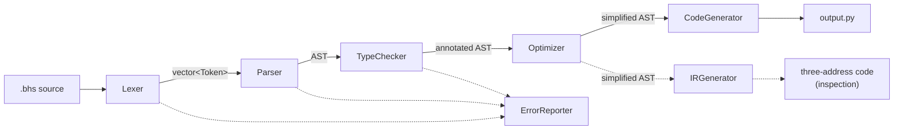
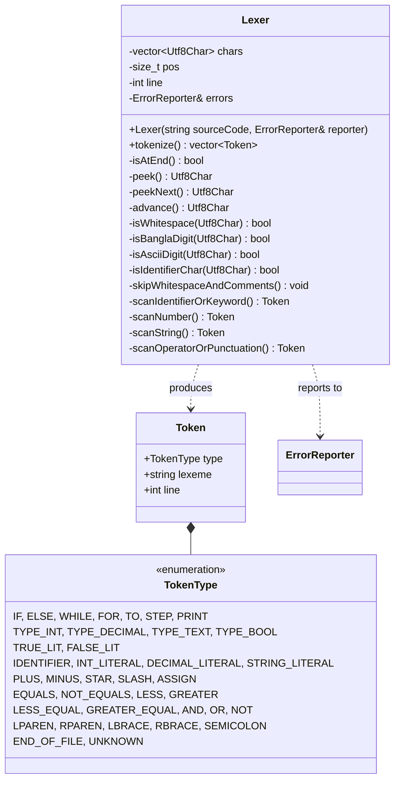
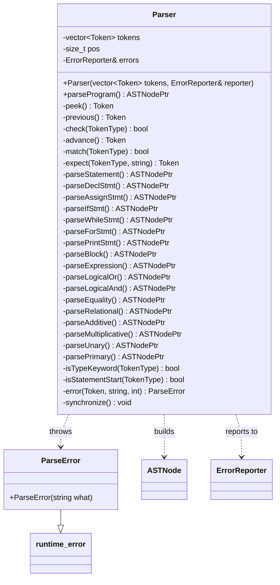
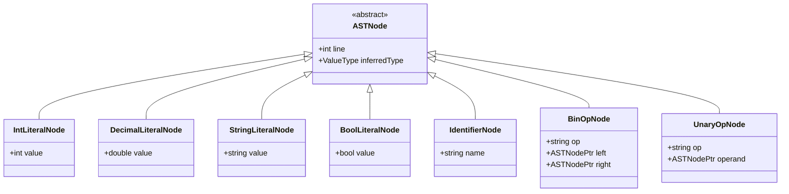
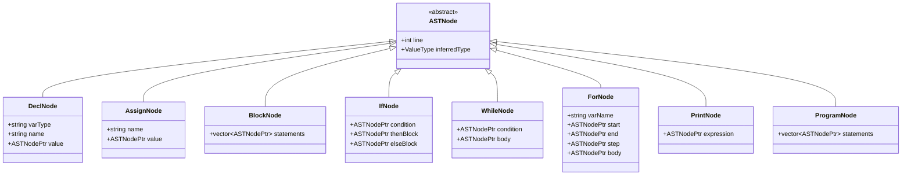
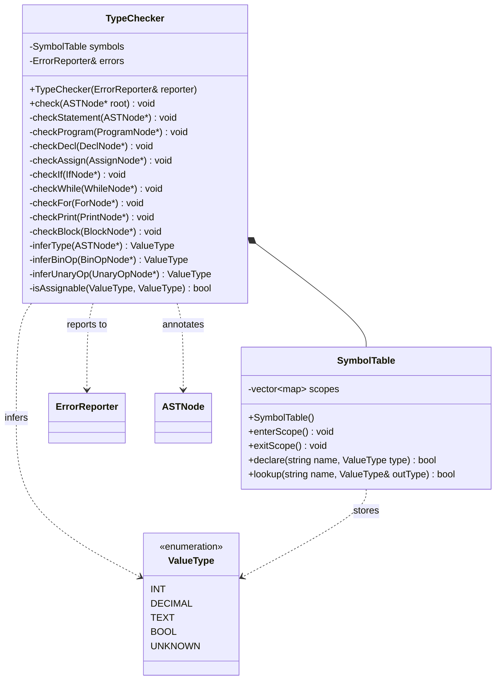
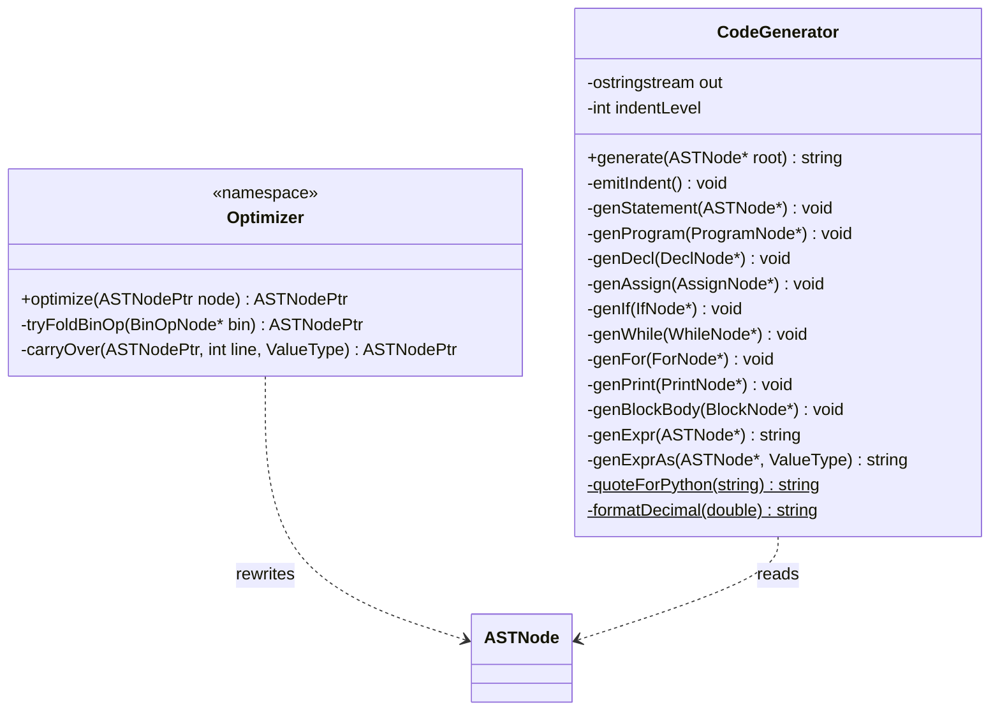
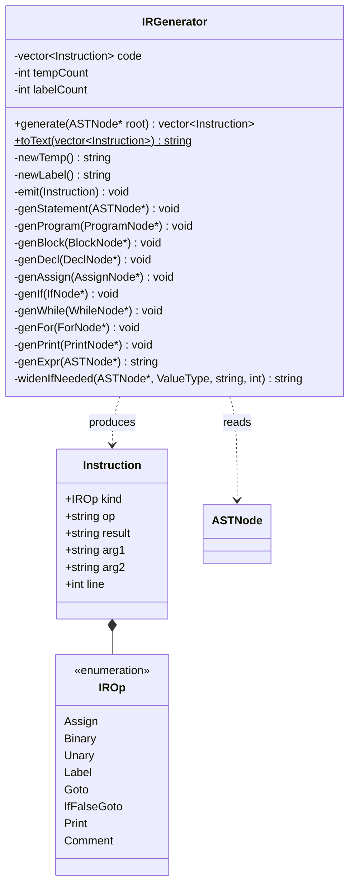
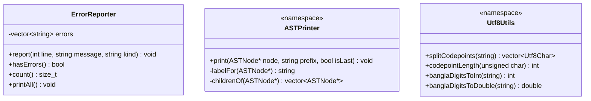

# Compiler Design

A high-level description of the compiler architecture, with UML diagrams
of all major classes. Diagrams are written in Mermaid, which renders in
GitHub, VS Code (with the Markdown Preview Mermaid extension) and on
mermaid.live for exporting as an image.

---

## 1. Architecture overview

The compiler is a six-stage pipeline. Each stage consumes the product of
the previous one and produces a single, well-defined artefact:

| Stage | Input | Output | Main class |
|---|---|---|---|
| Lexical analysis | UTF-8 source text | token stream | `Lexer` |
| Syntax analysis | token stream | AST | `Parser` |
| Semantic analysis | AST | annotated AST | `TypeChecker` |
| Optimization | annotated AST | simplified AST | `Optimizer` |
| Intermediate code | simplified AST | three-address code | `IRGenerator` |
| Code generation | simplified AST | Python source text | `CodeGenerator` |
| Error reporting | messages from every stage | diagnostics | `ErrorReporter` |

Two design decisions shape the whole structure:

**One shared `ErrorReporter`.** Every stage reports into the same
collector instead of printing. `main` checks the error count after each
stage and stops if it is non-zero, so code generation can never run on a
program that failed to parse or type-check.

**The AST is the common currency.** Stages 2 to 5 all speak in terms of
the same `ASTNode` hierarchy. The type checker writes its conclusions
onto the nodes (`inferredType`), the optimizer preserves that annotation
when it rebuilds nodes, and the code generator reads it. This is what
lets the generated Python respect the language's type rules.



---

## 2. Front end: Lexer

`Lexer` turns UTF-8 source text into tokens. It works on *codepoints*
rather than bytes, because a Bangla character occupies three bytes;
`Utf8Utils::splitCodepoints` performs that division once up front.



---

## 3. Syntax analysis: Parser and the AST

`Parser` is a recursive-descent parser. Each grammar non-terminal has one
function, and the expression functions are layered by precedence.

On a syntax error it reports the problem and throws `ParseError`, which
`parseProgram` and `parseBlock` catch. `synchronize()` then skips to the
next safe point — just past a `;`, at a `}`, or at a token that can begin
a statement — so one bad statement does not discard the rest of the file.
The caller guarantees the cursor always moves forward, so recovery can
never loop.



### AST: expression nodes

Every node inherits from `ASTNode`, which carries the source line (for
error messages) and the type the checker inferred (for code generation).
The hierarchy is split across two diagrams for legibility; both inherit
from the same base.



`BinOpNode` and `UnaryOpNode` own their operands, so an expression such as
`(২ + ৩) * ৪` becomes a tree whose shape alone encodes precedence — no
parentheses are stored.

### AST: statement nodes



Ownership is expressed with `std::unique_ptr<ASTNode>` (aliased as
`ASTNodePtr`): a parent owns its children, and destroying the root frees
the whole tree. No node is ever deleted by hand.

---

## 4. Semantic analysis: TypeChecker and SymbolTable

`TypeChecker` walks the tree twice in effect: `check*` functions handle
statements, `infer*` functions compute the type of an expression. Every
`inferType` call records its result on the node, which is how type
information reaches the code generator.

`SymbolTable` is a stack of scopes. `declare` only ever writes to the
innermost scope, so redeclaration in the same block is an error while
shadowing in a nested block is not; `lookup` searches outward, so a loop
body can see outer variables.



`ValueType::UNKNOWN` exists so that one error does not cascade: once an
expression is known to be faulty, its type becomes `UNKNOWN` and
surrounding checks stay quiet rather than reporting the same mistake
several times over.

---

## 5. Optimization and code generation

`Optimizer` is a free function rather than a class, because it holds no
state: it takes ownership of a tree and returns a new one. Its current
transformation is constant folding — an expression made entirely of
literals is evaluated at compile time and replaced by a single literal
node. Every rebuilt node copies across `line` and `inferredType`.

`CodeGenerator` walks the final tree and emits Python. It is the only
stage that knows anything about the target language: Python's `and`/`or`,
four-space indentation, `True`/`False`, `range()`, and string escaping all
live here and nowhere else.



`genExprAs` is where the type annotation earns its keep: when an integer
value is stored in a `দশমিকসংখ্যা` variable, it emits `5.0` rather than
`5`, so the generated Python agrees with the language's type rules.

---

## 6. Intermediate representation

`IRGenerator` lowers the optimized tree into three-address code: a flat
list of instructions in which every operation has at most three operands,
expressions are broken apart using temporaries (`t1`, `t2`, …), and all
control flow is explicit jumps between labels.



A nested expression flattens depth-first, so `বার্তা + " " + নাম` becomes
two instructions joined by a temporary:

```
t1 = বার্তা + " "
t2 = t1 + নাম
পূর্ণ = t2
```

and a `যতক্ষণ` loop becomes a test, a conditional exit and a jump back:

```
L1:
    t4 = গণনা < সীমা
    ifFalse t4 goto L2
    print গণনা
    t5 = গণনা + 1
    গণনা = t5
    goto L1
L2:
```

A `প্রতি` loop is lowered the same way, with the bounds evaluated once
before the loop and the comparison chosen from the sign of the step, so a
countdown tests with `>` rather than `<`. The int-to-decimal widening the
type checker permits appears as an explicit cast — `t1 = (দশমিকসংখ্যা)ক`
— rather than happening silently.

**Where this sits in the pipeline.** The Python backend reads the
annotated AST directly, so the AST is this compiler's primary
intermediate representation and the three-address code is an additional
form produced for inspection. That is a deliberate choice rather than an
omission: three-address code exists to bridge tree-shaped source and flat
target code, and Python is not flat — it has expressions, structured
control flow and indentation-based blocks. Lowering to jumps and then
reconstructing `if` and `while` from them would be work in both
directions, and would make the generated Python unreadable, costing the
language one of its main teaching arguments. A backend targeting
assembly, bytecode or WebAssembly would consume this representation
instead.

## 7. Support classes



`ErrorReporter` stores messages rather than printing them as they occur,
which is what makes staged compilation possible: `main` can ask how many
errors a stage produced and decide whether to continue.

`ASTPrinter` renders the tree for inspection. Printing it both before and
after optimization makes the optimizer's work visible.

`Utf8Utils` isolates the encoding details. Because Bangla digits are not
ASCII, converting `৩.১৪` to a `double` needs its own routine.

---

## 8. Class summary

| Class | Responsibility | Collaborators |
|---|---|---|
| `Lexer` | source text → tokens | `Token`, `Utf8Utils`, `ErrorReporter` |
| `Token` | one lexeme with its type and line | `TokenType` |
| `Parser` | tokens → AST, with error recovery | `ASTNode`, `ParseError`, `ErrorReporter` |
| `ASTNode` and subclasses | program representation | — |
| `TypeChecker` | type rules, scope rules, annotation | `SymbolTable`, `ValueType`, `ErrorReporter` |
| `SymbolTable` | scoped variable declarations | `ValueType` |
| `Optimizer` | constant folding | `ASTNode` |
| `IRGenerator` | AST → three-address code | `ASTNode`, `Instruction` |
| `Instruction` | one three-address instruction | `IROp` |
| `CodeGenerator` | AST → Python source | `ASTNode`, `ValueType` |
| `ErrorReporter` | collect and print diagnostics | — |
| `ASTPrinter` | render the tree for inspection | `ASTNode` |
| `Utf8Utils` | UTF-8 and Bangla numeral handling | — |